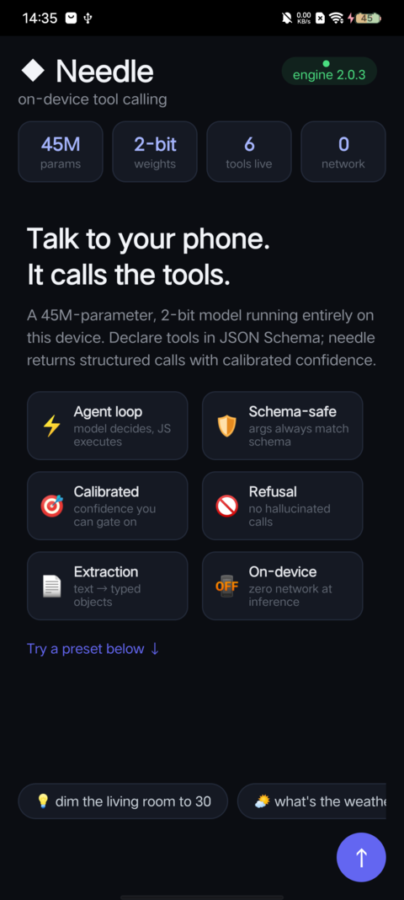
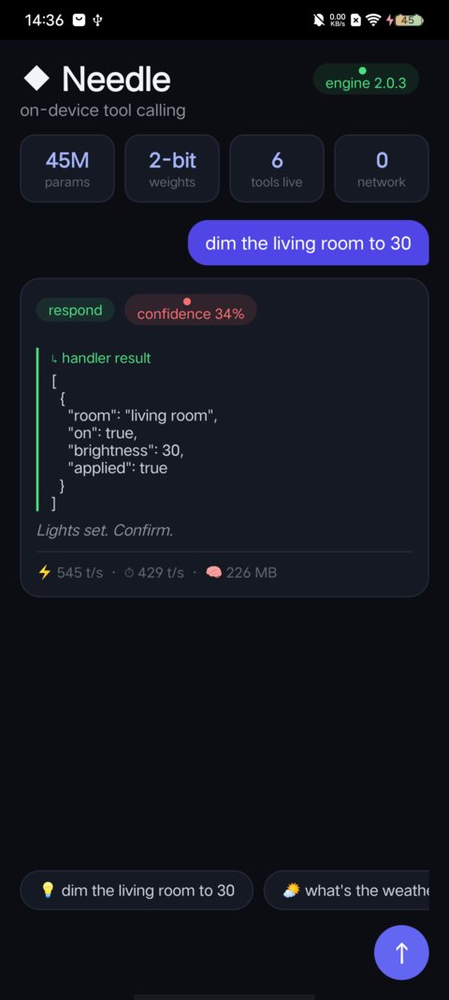
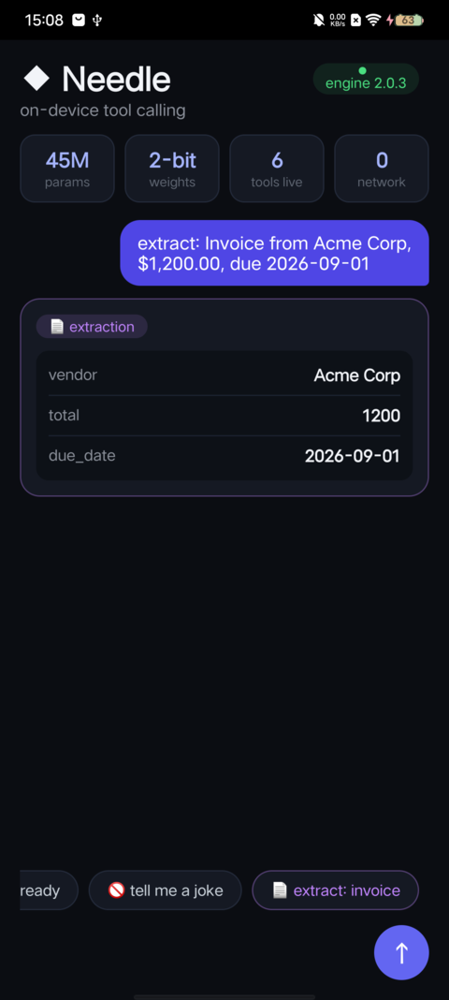

# lynx-needle

A [Lynx](https://github.com/lynx-family/lynx) AutoLink NAPI addon that embeds
[Cactus Needle 2](https://github.com/cactus-compute/needle) — a 45M-parameter,
2-bit tool-calling model — into Lynx pages on Android and iOS. The whole
engine (weights included) is one ~14MB static library; inference needs ~28MB
RAM and no network.

```
Lynx page JS ──▶ AutoLink NAPI loader ──▶ Needle addon ──▶ libneedle.a
```

## Screenshots

Running on a real Android device (Lynx 4.3.0 nightly, no network):

| Welcome & capabilities | Tool-calling turn | Structured extraction |
| --- | --- | --- |
|  |  |  |

## What the model does

Tool calling and structured extraction. You declare JSON-Schema tools, the
model returns structured calls (`{name, arguments}`) with a calibrated
confidence score. A byte-level grammar compiled from your schemas constrains
every output token. With more than 5 tools declared, a retrieval head renders
only the top-5 per turn. Context is a 256-token sliding window (tools pinned),
so memory stays bounded regardless of conversation length.

## Repository layout

| Path | What it is |
| --- | --- |
| `src/` | Public TypeScript API: `loadNeedle()` / `createNeedle()`; built into `lib/` |
| `types/` | NAPI declaration consumed by `@lynx-js/autolink-codegen-canary` |
| `generated/` | Generated BTS facade; loads `Needle` through the Lynx NAPI module loader |
| `shared/nativeModule/` | Shared C++ NAPI implementation and generated registration code |
| `android/` | Source-built AutoLink Android library; produces `libNeedle.so` |
| `ios/` | AutoLink CocoaPods pod and `lynx-needle.xcframework` |
| `lib/` | Generated by `npm run build` (tsc) — the npm package payload (gitignored) |
| `build/` | Generated cmake build trees; Darwin `.a` slices land in `build/<dir>/out/` (gitignored) |

## Prerequisites

Use a Lynx 4.3 nightly built with NAPI binding. The Android example is
validated with `4.3.0-nightly.202609080610.178.gcd26ecb7-SNAPSHOT`, resolved
from the Maven Central snapshot repository:

  ```gradle
  // settings.gradle
  maven { url 'https://central.sonatype.com/repository/maven-snapshots/' }

  // app/build.gradle
  implementation 'org.lynxsdk.lynx:lynx:4.3.0-nightly.202609080610.178.gcd26ecb7-SNAPSHOT'
  ```

The iOS example is validated against
`4.3.0-nightly.202609090610.180.g5e30c9e6` from
`https://github.com/lynx-family/Specs.git`; that podspec downloads the published
zip from `artifacts-storage.tos-s3-ap-southeast-1.bytepluses.com`. On Android,
keep PrimJS on the version declared by that Lynx AAR
(`4.2.0-alpha.0-SNAPSHOT` at the time of this snapshot); forcing
`primjs:4.3.0-alpha.0-SNAPSHOT` with this Lynx build makes `lynx_core.js` fail
before the page loads.

Against a runtime without NAPI binding the frontend API reports the addon as
unavailable (`loadNeedle()` returns `null`) by design.

The package pins these AutoLink canaries:

```text
@lynx-js/autolink-codegen-canary@0.6.0-canary-20260908-9352a903
create-lynx-library-canary@0.6.1-canary-20260908-9352a903
```

## AutoLink integration

Install `lynx-needle` in both the BTS package and the host package. The host
AutoLink plugin scans `lynx.lib.json`; application code does not register a
`LynxNodeAPI` module or attach a runtime listener manually.

### Android

Apply the Lynx library settings/build plugins from the same 4.3 nightly:

```gradle
// settings.gradle
plugins {
  id 'org.lynxsdk.lynx.library-settings' version '4.3.0-nightly.202609080610.178.gcd26ecb7-SNAPSHOT'
}

// app/build.gradle
plugins {
  id 'org.lynxsdk.lynx.library-build'
}
```

After normal Lynx initialization, run the generated global AutoLink setup:

```java
LynxEnv.inst().init(this, null, templateProvider, null);
LynxAutolinkGenerated.setupGlobal(this);
```

The generated registry loads `libNeedle.so` and registers addon name `Needle`.
No per-`LynxView` attach call is needed.

### iOS

Use Bundler to keep CocoaPods and the AutoLink plugin aligned with the Lynx
version used by the host:

```ruby
# Gemfile
source 'https://rubygems.org'

gem 'cocoapods', '1.14.3'
gem 'cocoapods-lynx-library', '4.3.0.pre.nightly.202609090610.180.g5e30c9e6'
```

```ruby
# Podfile
platform :ios, '12.0'
source 'https://github.com/lynx-family/Specs.git'
source 'https://cdn.cocoapods.org/'

install! 'cocoapods',
         :generate_multiple_pod_projects => true,
         :incremental_installation => true
plugin 'cocoapods-lynx-library'

target 'YourApp' do
  use_frameworks! :linkage => :static

  use_lynx_library!(
    :root => __dir__,
    :output_dir => File.join(__dir__, 'generated/lynx-library')
  )

  lynx_version = '4.3.0-nightly.202609090610.180.g5e30c9e6'
  pod 'Lynx', lynx_version
  pod 'LynxBase', lynx_version
  pod 'LynxServiceAPI', lynx_version
end
```

Install the npm dependency before running CocoaPods: the AutoLink plugin scans
the host's `node_modules/lynx-needle/lynx.lib.json` and resolves the local
podspec from there.

```bash
npm install
bundle install
bundle exec pod install
```

The CocoaPods plugin reads the npm dependency, adds the `lynx-needle` pod, and
generates `LynxGeneratedNodeAPIAddonUse.mm`. That registry includes
`addon_use.h`, initializes the PrimJS weak Node-API bridge, and invokes
`_napi_register_xx_Needle()`. Host Objective-C++ code does not include the
retention header directly.

## Frontend usage (npm package)

```bash
npm install lynx-needle        # or: "lynx-needle": "file:<path-to-package>"
```

For the local `file:` form, build the package first (`npm run build` at the
package root) — `lib/` is generated by tsc and not committed.

```js
import { loadNeedle } from 'lynx-needle'

const needle = await loadNeedle()   // null when the host has no addon loader
if (!needle) { /* show setup instructions */ }

// 1. Declare tools and start a session.
needle.init('You control a smart home.', [
  {
    name: 'set_lights',
    description: "Turn a room's lights on or off and set brightness",
    parameters: {
      type: 'object',
      properties: {
        room: { type: 'string' },
        on: { type: 'boolean' },
        brightness: { type: 'integer', minimum: 0, maximum: 100 },
      },
      required: ['room', 'on'],
    },
  },
])

// 2. Agent loop: the model decides calls, your handlers execute them.
const result = await needle.run('dim the living room to 30', {
  set_lights: ({ room, on, brightness }) => ({ room, on, brightness, applied: true }),
})
// result.function_calls / result.results / result.confidence / result.peak_ram_mb

// 3. One-shot structured extraction.
const invoice = await needle.extract('Invoice from Acme Corp, $1,200.00, due 2026-09-01', {
  name: 'Invoice',
  parameters: {
    type: 'object',
    properties: { vendor: { type: 'string' }, total: { type: 'number' }, due_date: { type: 'string' } },
    required: ['vendor', 'total', 'due_date'],
  },
})
```

API summary (full types in `src/needle.ts`):

- `loadNeedle(timeoutMs?) → Promise<NeedleAgent | null>` — asks the generated
  AutoLink facade for addon `Needle`; it returns `null` if the host has not
  installed the Lynx NAPI loader. `timeoutMs` is retained for API compatibility
  but is currently ignored because loading is synchronous.
- `init(system, tools, toolIndexPath?)` — (re)start the session.
- `complete(input, maxNewTokens?) → Promise<NeedleResponse>` — raw inference,
  off the JS thread.
- `run(query, handlers, {maxSteps, maxNewTokens}) → Promise<NeedleRunResult>`
  — the agent loop (adds `results`).
- `extract(text, schema, {system, maxNewTokens})` — one-shot extraction.
- `reset()` — rewind the conversation, keep tools.
- `load(cactPath)` — bind LoRA-tuned weights (one-way!).
- `engineVersion()` — e.g. `"2.0.3"`.

`response` envelope:

```json
{
  "type": "call",
  "success": true,
  "error": null,
  "error_code": null,
  "function_calls": [{"name": "set_lights", "arguments": {"room": "living room", "on": true, "brightness": 30}}],
  "confidence": 0.92,
  "reasoning": "...",
  "prefill_tps": 668.2, "decode_tps": 161.6, "peak_ram_mb": 27.7
}
```

`type === "call"` with an empty `function_calls` means the model refused an
off-topic input; `"respond"` means the loop finished. There is no free-text
fallback by design.

## Run the demos

### Android: `examples/android-host` × `examples/lynx-needle-demo`

```bash
# 1. Repo root in this checkout: build the package and Android AutoLink library
npm install && npm run fetch-engine && npm run build:android

# 2. Frontend demo dev server (prints the bundle URL / QR)
npm run build   # the demo consumes lib/ via a file: dependency on `packages/lynx-needle`
cd examples/lynx-needle-demo && npm install && npm run dev   # e.g. :3000/main.lynx.bundle

# 3. Host app (JDK 17 + Android SDK)
cd ../../examples/android-host
./gradlew :app:assembleDebug
adb install -r app/build/outputs/apk/debug/app-debug.apk
# Open "Needle Host" and scan the QR code from step 2.
```

The example already pins the 4.3.0 nightly snapshot (NAPI-enabled), so the
full flow works out of the box. Against older release-repo Lynx versions the
page renders but reports "addon not available" — see the prerequisite section.

### iOS: `examples/ios-host` × `examples/lynx-needle-demo`

```bash
# 1. Repo root in this checkout: install tooling, fetch the engine, and build the pod artifacts
npm install
npm run fetch-engine
npm run build:ios

# 2. Frontend demo dev server (same as above), or build once for the bundled template
(cd examples/lynx-needle-demo && npm install && npm run build)

# 3. Host app (requires Bundler/CocoaPods; generates the Xcode project on first run)
cd examples/ios-host
npm install                   # links node_modules/lynx-needle to packages/lynx-needle
bundle install                # installs the pinned CocoaPods and AutoLink plugin
bundle exec ruby generate-project.rb
bundle exec pod install
open NeedleHost.xcworkspace   # build & run on a device/simulator
```

The sample Podfile uses `cocoapods-lynx-library`, which generates the AutoLink
registry pod from `lynx.lib.json`. The Lynx pod comes from
`https://github.com/lynx-family/Specs.git`, not CocoaPods Trunk.

## Build the addon from source

Prerequisites: Node ≥ 22, CMake, `npm install`. Engine binaries are pinned to
needle engine **2.0.3** and fetched from Hugging Face:

```bash
npm run fetch-engine    # needle.h + libneedle.a for Android/iOS/macOS
```

### Package validation

Before publishing, run the workspace pack check from the repository root:

```bash
npm run pack:needle
```

The package's `prepack` hook regenerates the AutoLink/TypeScript outputs and
fails when a required Needle engine archive or iOS xcframework artifact is
missing. If it reports missing iOS files, run `npm run build:ios` and retry.

### Android (arm64-v8a, armeabi-v7a)

```bash
npm run build:android   # ANDROID_NDK auto-detected from $ANDROID_HOME/ndk
# -> android/src/main/jniLibs/<abi>/{libNeedle,libnapi,libnapi_adapter}.so
```

Note: `armeabi-v7a` builds compile `cpp/shim_hash_memory.cc` — the prebuilt
32-bit engine references `std::__ndk1::__hash_memory`, which modern NDKs no
longer export; the shim is the canonical libc++ murmur2 implementation.

### iOS (arm64 device + simulator)

```bash
npm run build:ios
# -> build/ios-{device,sim}/out/libNeedle.a (merged with engine)
# -> ios/{lynx-needle.xcframework, lynx-needle.podspec, addon_use.h}
```

## How it works

- `types/napi-native-module.d.ts` — AutoLink source declaration for the NAPI
  module. `npm run codegen` writes the JS facade, C++ registration block, iOS
  wrapper, and `addon_use.h`.
- `src/needle.ts` — public wrapper over generated `requireNeedle()`. It keeps
  the older `loadNeedle()` / `createNeedle()` API while loading through
  `globalThis.getNapiLoader()`, `globalThis.__lynxNapiLoader`, or
  `lynx.getModuleLoader()`.
- `shared/nativeModule/Needle.cc` — NAPI bindings over the engine's 4-function C ABI
  (`needle_init` / `needle_complete` / `needle_reset` / `needle_load`, see
  `third_party/needle/include/needle.h`). `complete` runs on a
  `Napi::AsyncWorker` so inference never blocks the JS thread; a process-wide
  mutex serializes all engine calls because the engine is single-session and
  not thread-safe. The 64KB output buffer grows to 1MiB and retries once if
  the engine reports failure.
- `android/CMakeLists.txt` — builds `libNeedle.so` from the shared C++ object
  target and links the PrimJS NAPI libraries extracted by Gradle.
- `ios/CMakeLists.txt` — builds device and simulator static addon slices from
  the generated wrapper, then `scripts/package-darwin.mjs` packages
  `ios/lynx-needle.xcframework` and the podspec consumed by AutoLink.
- `tools/fetch-engine.sh` — pins and downloads engine artifacts.

## Known limitations (engine-inherent)

- **Single global session.** Multiple agents share one conversation state;
  re-`init` to switch toolsets, or run separate processes.
- **256-token sliding window.** Long conversations silently drop old context
  (tools stay pinned).
- **Tuned weights are one-way.** After `load()`, the base model cannot be
  restored in-process, and `confidence` becomes uncalibrated (`null`).
- **No streaming.** The ABI returns the whole response at once.

## License

MIT. Engine binaries are distributed by Cactus Compute under the
needle project's license; the NAPI scaffolding is from
`@lynx-js/weak-node-api` and Lynx AutoLink.
